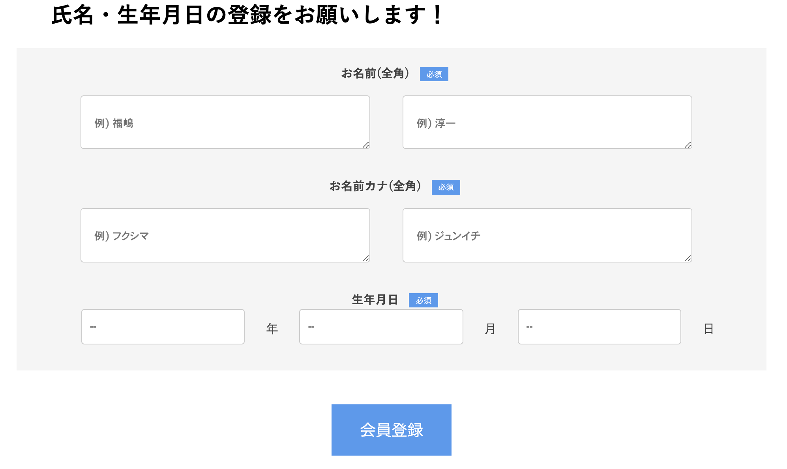
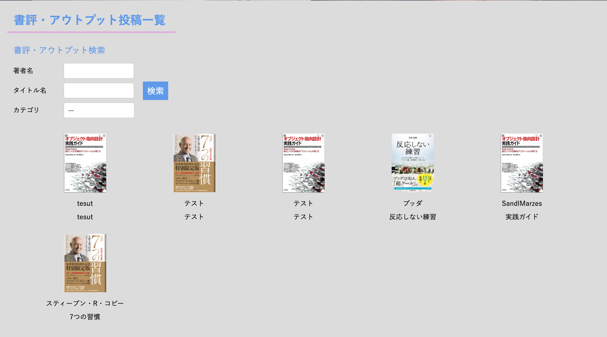
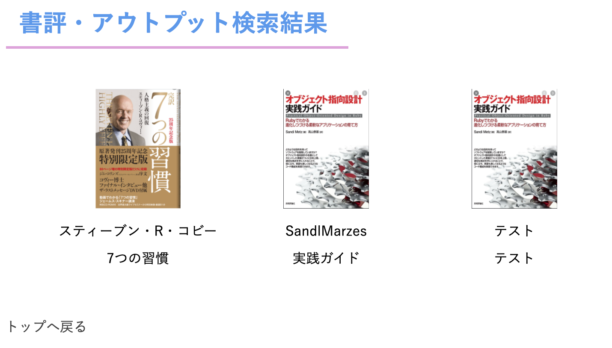

# アプリケーション概要
- 使用言語
Ruby(on Rails)/JavaScript/SCSS
- 書評を記録するためのアプリケーション

- デモサイト
https://book-sharing-rails.herokuapp.com/

# 機能概要
## ユーザー管理機能
- ログイン・新規登録機能
- ウィザード形式をお持ちいた登録機能

- SNS認証 [Google & FaceBook]

## 書評投稿機能
- 新規投稿・編集・削除機能実装
- 画像投稿時はプレビューの表示

## 書評検索機能
- ransackを用いた検索機能の実装

## いいね機能
- 非同期通信でいいね機能の実装

