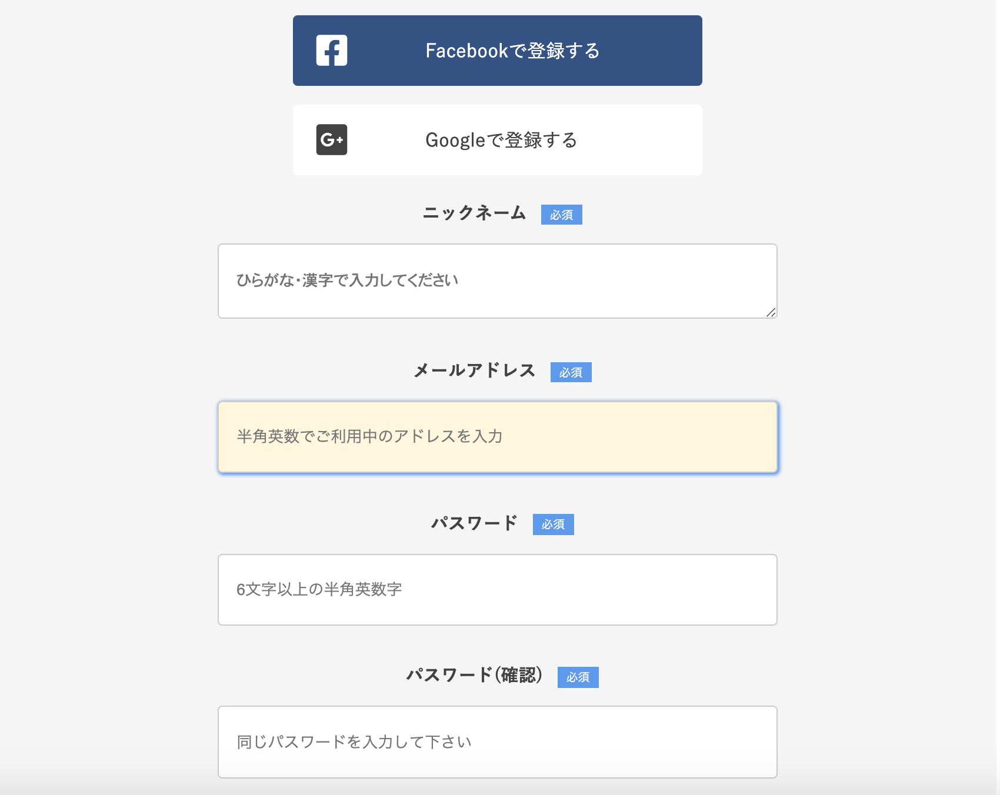
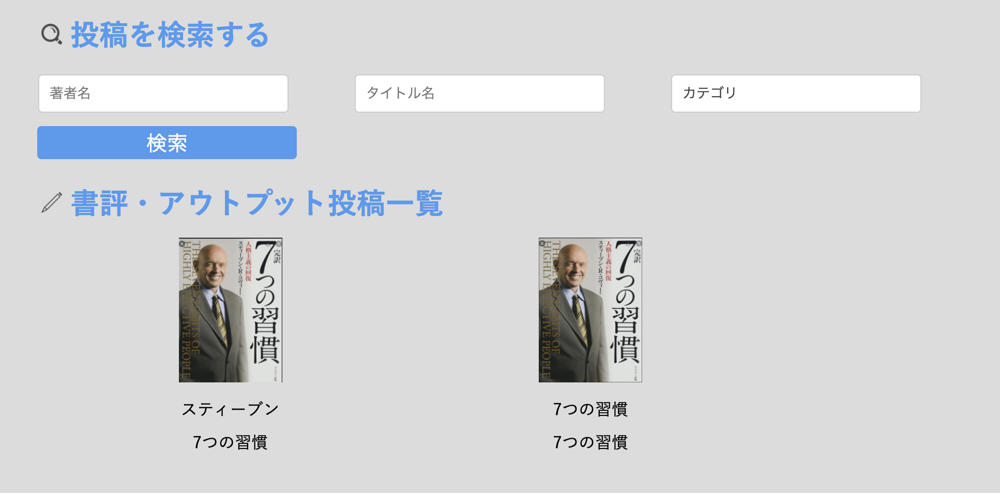

# アプリケーション概要
駆け出しの頃のポートフォリオです。お手柔らかにお願いします😂
- 使用言語
Ruby(on Rails)/JavaScript/SCSS
- 書評を記録するためのアプリケーション

- スマホ画面

- デモサイト(AWS EC2 & S3)
http://54.238.36.232/

# 機能概要
## ユーザー管理機能
- ログイン・新規登録機能
- ウィザード形式をお持ちいた登録機能

- SNS認証 [Google & FaceBook]
SNS認証は開発環境のみ実装（ドメインの取得が必要なため）

## 書評投稿機能
- 新規投稿・編集・削除機能実装
- 画像投稿時はプレビューの表示

## 書評検索機能
- ransackを用いた検索機能の実装

## いいね機能
- 非同期通信でいいね機能の実装

